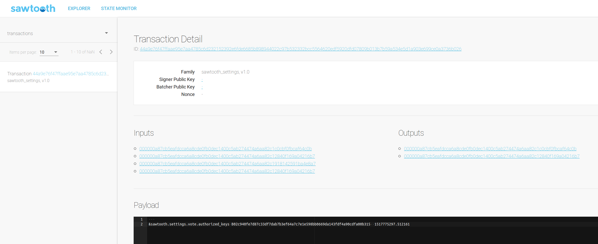

# Vagrant machine for Hyperledger Sawtooth Development

## WARNING: this is a WORK IN PROGRESS

## Requirements
Install vagrant and ansible on your host machine.

## Usage
Clone this repository:
```
$ git clone https://github.com/cmoro-deusto/vagrant-hyperledger-sawtooth-dev.git
$ cd vagrant-hyperledger-sawtooth-dev
```
Bring the vm up:
```
$ vagrant up
```
That will take a while. Once finished, just ssh into the vm:
```
$ vagrant ssh
```
If you got this far, you should have sawtooth example network containers up and running inside the vm. You can check that as follows:
```
$ docker ps
```
You should see several containers running.

## Working with sawtooth
ssh into the vm and launch the `sawtooth-shell.sh` command:
```
$ cd /vagrant
$ ./sawtooth-shell.sh
```
Check that the Sawtooth REST API is running:
```
# curl http://rest-api:8008/blocks
```
You can also access the REST API from within the vagrant vm without starting the sawtooth-shell container:
```
$ curl http://localhost:8008/blocks
```

## Launching Sawtooth Explorer
You can start Sawtooth Explorer as follows:
```
$ cd /vagrant
$ ./sawtooth-explorer.sh
```
The script is very simple, it just runs `ng serve --host 0.0.0.0` on the `/vagrant/sawtooth-explorer` directory. You can also start and stop Sawtooth Explorer issuing the appropriate `ng` commands yourself.

Once webpack is finished compiling and the app is up, just go to `http://localhost:4200` on your browser:



### Note: 
You might find errors about not being able to communicate with the sawtooth api. Those are probably caused by your browser not allowing CORS request on localhost. You could use [this Firefox extension](https://addons.mozilla.org/en-US/firefox/addon/cors-everywhere/) to enable CORS on localhost easily.

## Vagrant vm starting and basic usage demo
[](https://asciinema.org/a/FrXdgkkh7mK0Kzic0p3v9Z8Ui)

## Note
The Hyperledger Sawtooth instalation is done following [this guide](https://sawtooth.hyperledger.org/docs/core/releases/latest/app_developers_guide/docker.html). Hyperledger Sawtooth is currently in _active_ development and suffers frequent changes. Provisioning might fail, you have been warned!!

## Warning
All the contents of the guest's (the vagrant vm) `/vagrant` folder are mapped to the host's (your machine)vagrant project directory using Virtual Box shared folders. That means anything you touch in the host project folder will also be changed in the guest `/vagrant` folder and viceversa. You might find this usefull for development, but bear in mind that the provision vagrant command will *delete* the `/vagrant/sawtooth-explorer` in each run, so beware if you have modifications to the Sawtooth Explorer code!
